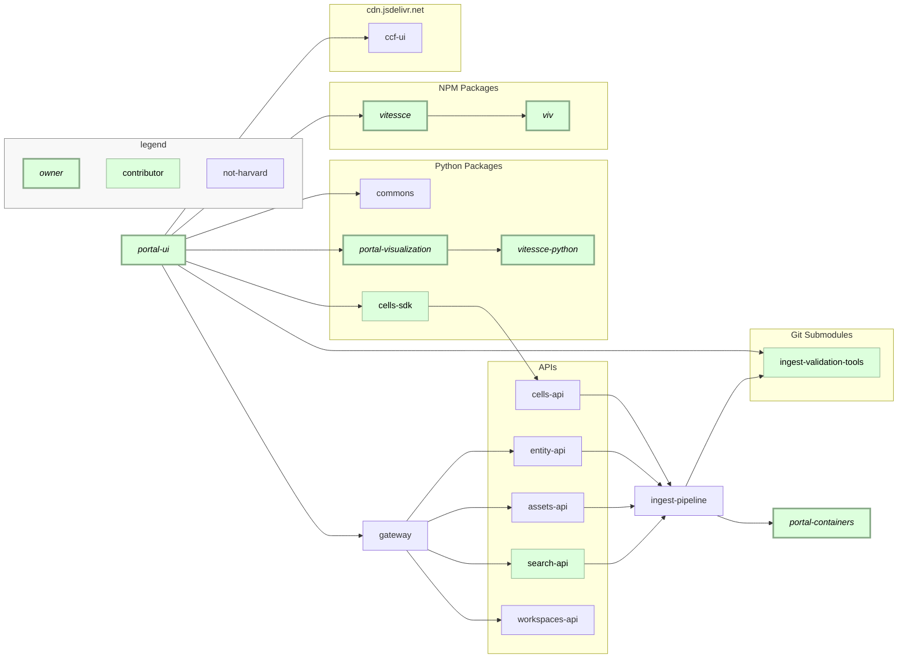

# portal-ui

HuBMAP Data Portal:
This is a Flask app, using React on the front end and primarily Elasticsearch on the back end,
wrapped in a Docker container for deployment using Docker Compose. The front end depends on AWS S3 and CloudFront for the hosting and delivery of images.
It is deployed at [portal.hubmapconsortium.org](https://portal.hubmapconsortium.org/)

The Data Portal depends on many [APIs](https://portal.hubmapconsortium.org/services),
and directly or indirectly, on many other HuBMAP repos.



## Feedback

Issues with the Portal can be reported [via email](mailto:help@hubmapconsortium.org).
More information on how issues are tracked across HuBMAP is available
[here](https://software.docs.hubmapconsortium.org/feedback).

## Design

We try to have a design ready before we start coding.
Often, issues are filed in pairs, tagged [`design`](https://github.com/hubmapconsortium/portal-ui/issues?q=is%3Aissue+is%3Aopen+label%3Adesign)
and [`enhancement`](https://github.com/hubmapconsortium/portal-ui/labels/enhancement).
All designs are in [Figma](https://www.figma.com/files/team/834568130405102661/HuBMAP).
(Note that if that link redirects to `/files/recent`, you'll need to be added to the project, preferably with a `.edu` email, if you want write access.)

## Development

### Prerequisites

- `git`: Suggest [installing Apple XCode](https://developer.apple.com/xcode/).
- `python 3.9`
  - MiniConda:
    - [installing miniconda](https://docs.conda.io/en/latest/miniconda.html#macosx-installers) and [creating a new conda environment](https://docs.conda.io/projects/conda/en/latest/user-guide/tasks/manage-environments.html#creating-an-environment-with-commands): `conda create -n portal python=$(cat .python-version)`
  - pyenv:
    - `brew install pyenv`
    - `brew install pyenv-virtualenv`
    - `` pyenv install `cat .python-version`  ``
    - `` pyenv virtualenv `cat .python-version` portal ``
    - `pyenv activate portal`
- `nodejs`: Suggest [installing nvm](https://github.com/nvm-sh/nvm#installing-and-updating) and then using it to install the appropriate node version: `nvm install`.
  - `` nvm install `cat .nvmrc`  ``
  - `` nvm use `cat .nvmrc`  ``
- `pnpm`: Suggest [install pnpm via npm](https://pnpm.io/installation#using-npm) after installing the proper `nodejs` version.

Optional:

- `VS Code`, with [recommended extensions](./.vscode/extensions.json).
  - While this is optional, it is worth noting that it is in use by the whole development team
  - Using VS Code lets us share [default configuration settings](./.vscode/default.settings.json) and easily run scripts using [VS Code tasks](./.vscode/tasks.json).
- `docker`
  - Docker is necessary in order to create images for the [deploy process](https://hms-dbmi.atlassian.net/wiki/spaces/GL/pages/3009282049/Deployment)
  - It is also used to run a local instance of the application when using the test scripts in the `./etc` directory

### Development

After checking out the project, cd-ing into it, and setting up a Python 3.9 virtual environment,

- Get `app.conf` from [Confluence](https://hms-dbmi.atlassian.net/wiki/spaces/GL/pages/3045457929/app.conf) or from another developer and place it at `context/instance/app.conf`.
- Run `etc/dev/dev-start.sh` to start the webpack dev and flask servers and then visit [localhost:5001](http://localhost:5001).
  - If using VS Code, you can also use the `dev-start` task, which will launch these services in separate terminal windows.

The webpack dev server serves all files within the public directory and provides hot module replacement for the react application;
The webpack dev server proxies all requests outside of those for files in the public directory to the flask server.

Note: Searchkit, our interface to Elasticsearch, has changed significantly in the latest release. Documentation for version 2.0 can be found [here](https://github.com/searchkit/searchkit/tree/6f3786657c8afa6990a41acb9f2371c28b2e0986/packages/searchkit-docs).

### Changelog files

Every PR should be reviewed, and every PR should include a new `CHANGELOG-something.md` at the root of the repository. These are concatenated by `etc/build/push.sh` during deploy.

### File and directory structure conventions

<details><summary>:atom_symbol: React</summary>

> **Note**  
> **Any mentions of `.js`/`.jsx` in the following guidelines are interchangeable with `.ts`/`.tsx`. New features should ideally be developed in TypeScript.**

- Components with tests or styles should be placed in to their own directory.
- Styles should follow the `style.*` pattern where the extension is `js` for styled components or `css` for stylesheets.
  - New styled components should use `styled` from `@mui/material/styles`.
- Supporting test files have specific naming conventions:
  - Jest Tests should follow the `*.spec.js` pattern.
  - Stories should follow the `*.stories.js` pattern.
  - Cypress tests should follow the `*.cy.js` pattern.
  - For all test files, the prefix is the name of the component.
- Each component directory should have an `index.js` which exports the component as default.
- Components which share a common domain can be placed in a directory within components named after the domain.

</details>

<details><summary>:framed_picture: Images</summary>

Images should displayed using the `source srcset` attribute. You should prepare four versions of the image starting at its original size and at 75%, 50% and 25% the original image's size preserving its aspect ratio. If available, you should also provide a 2x resolution for higher density screens.

- For example, to resize images using Mac's Preview you can visit the 'Tools' menu and select 'Adjust Size', from there you can change the image's width while making sure 'Scale Proportionally' and 'Resample Image' are checked. Once ready, each version of the image should be processed with an image optimizer such as [ImgOptim](https://imageoptim.com/mac) or [Online Image Compressor](https://imagecompressor.com/).

Finally after processing, the images should be added to the S3 bucket, `portal-ui-images-s3-origin`,
to be delivered by the cloudfront CDN.
SVG files larger than 5KB should also be stored in S3 and delivered by the CDN.
SVG files smaller than 5KB can be included in the repository in `context/app/static/assets/svg/`.
The CDN responds with a `cache-control: max-age=1555200` header for all items,
but can be overridden on a per image basis by setting the `cache-control` header for the object in S3.

If an uploaded file replaces an existing one and uses the same file name, a CloudFront cache invalidation should be run, targeting the specific file(s) that have been updated.

- Log in to the AWS console and go to [distributions](https://us-east-1.console.aws.amazon.com/cloudfront/v3/home?region=us-east-1#/distributions)
- Select the distribution corresponding to the S3 server.
- Go to the `Invalidations` tab and click `Create Invalidation`.
- Enter the file names which should be invalidated in cache, with the full path; you can target multiple similar file names by using wildcards
  - e.g. to invalidate all files in `/` starting with `publication-slide`, you would enter `/publication-slide*`, which would select all the different sizes of that image.
- After confirming that you are targeting only the intended files, click `Create Invalidation` again.

For the homepage carousel, images should have a 16:9 aspect ratio, a width of at least 1400px, a title, a description, and, if desired, a url to be used for the 'Get Started' button.

</details>

## Testing

Python unit tests use Pytest, front end tests use Jest, and end-to-end tests use Cypress.
Each suite is run separately on GitHub CI.

Load tests [are available](end-to-end/artillery/), but they are not run as part of CI.

### Running tests locally without docker

- **Jest**: `cd context; pnpm run test`
- **Cypress**: With the application running, `cd end-to-end; pnpm run cypress:open`
  - If using WSL2, see the WSL2-specific steps in the [end to end readme](./end-to-end/README.md).
  - Note that the cypress tests (particularly for the publication page) are expected to be run with the `test` environment enabled in app.conf
- **Pytest**: `cd context; pytest app --ignore app/api/vitessce_conf_builder`

### Linting and pre-commit hooks

CI lints the codebase, and to save time, we also lint in a pre-commit hook.
If you want to bypass the hook, set `HUSKY_SKIP_HOOKS=1`.

You can also lint and auto-correct from the command-line:

```
cd context
pnpm run lint
pnpm run lint:fix
EXCLUDE=node_modules,ingest-validation-tools,etc/dev/organ-utils
autopep8 --in-place --aggressive -r . --exclude $EXCLUDE
```

### Storybook

To start storybook locally you can either run `etc/dev/dev-start.sh`, or just `pnpm run storybook`,
and after it has started, visit [localhost:6006](http://localhost:6006).

## Build, tag, and deploy

The build, tag, deploy, and QA procedures are [detailed here](https://hms-dbmi.atlassian.net/wiki/spaces/GL/pages/3009282049/Deployment).

### Understanding the build

<details><summary>Webpack</summary>

To view visualizations of the production webpack bundle run `pnpm run build:analyze`.
The script will generate two files, report.html and stats.html, inside the public directory each showing a different visual representation of the bundle.

</details>

<details><summary>Docker</summary>

To build and run the docker image locally:

```sh
etc/dev/docker.sh 5001 --follow
```

Our base image is based on [this template](https://github.com/tiangolo/uwsgi-nginx-flask-docker#quick-start-for-bigger-projects-structured-as-a-python-package).

</details>

<details><summary>Docker Compose</summary>

In the deployments, our container is behind a NGINX reverse reproxy;
Here's a [simple demonstration](compose/) of how that works.

</details>

## Related projects and dependencies

### Search and Metadata

The metadata that we have for each dataset ultimately comes from the data providers,
but the fields they supply are determined by the schemas in [`ingest-validation-tools`](https://github.com/hubmapconsortium/ingest-validation-tools#readme).
That repo is also included as a submodule here, and human-readable field descriptions are pulled from it.

The portal team contributes code to a [subdirectory within `search-api`](https://github.com/hubmapconsortium/search-api/tree/main/src/elasticsearch/addl_index_transformations)
to clean up the raw Neo4J export and provide us with clean, usable facets.
Within that directory, [`config.yaml`](https://github.com/hubmapconsortium/search-api/blob/test-release/src/elasticsearch/addl_index_transformations/portal/config.yaml) configures the Elasticsearch index itself.

### Visualization

Data visualization is an integral part of the portal, allowing users to view the results of analysis pipelines or raw uploaded data easily directly in the browser. How such data is processed and prepared for visualization in the client-side Javascript via [`vitessce`](https://github.com/hubmapconsortium/vitessce) can be found [here](https://github.com/hubmapconsortium/portal-visualization#readme).

General-purpose tools:

- [`viv`](https://github.com/hms-dbmi/viv): JavaScript library for rendering OME-TIFF and OME-NGFF (Zarr) directly in the browser. Packaged as [deck.gl](https://deck.gl/) layers.
- [`vitessce`](https://github.com/hubmapconsortium/vitessce): Visual integration tool for exploration of spatial single-cell experiments. Built on top of [deck.gl](https://deck.gl/).
- [`vitessce-python`](https://github.com/vitessce/vitessce-python): Python wrapper classes which make it easier to build configurations.

Particular to HuBMAP:

- [`portal-visualization`](https://github.com/hubmapconsortium/portal-visualization): Given HuBMAP Dataset JSON, creates a Vitessce configuration.
- [`portal-containers`](https://github.com/hubmapconsortium/portal-containers): Docker containers for visualization preprocessing.
- [`airflow-dev`](https://github.com/hubmapconsortium/airflow-dev): CWL pipelines wrapping those Docker containers.
