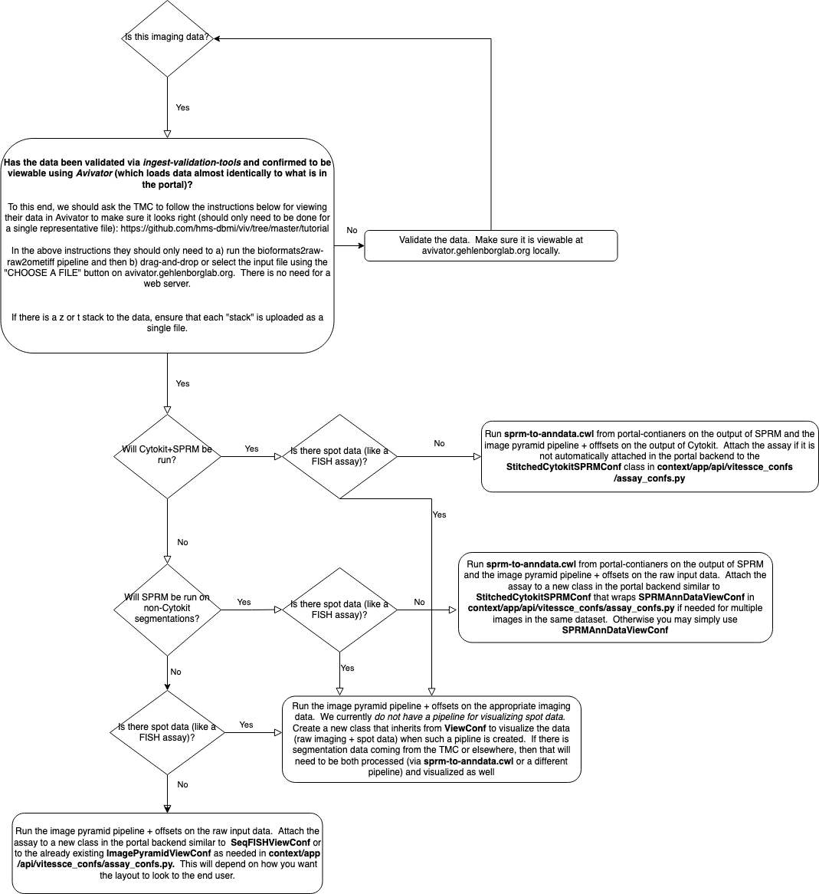

# Vitessce Visualization

Data for the Vitessce visualization almost always comes via raw data that is processed by [ingest-pipeline](https://github.com/hubmapconsortium/ingest-pipeline) airflow dags.  Harvard often contributes our own custom pipelines to these dags that can be found in [portal-containers](https://github.com/hubmapconsortium/portal-containers).

## Imaging Data

HuBMAP receives various imaging modalities (microscopy and otherwise).  The processing is fairly uniform, and always includes running [ome-tiff-pyramid](https://github.com/hubmapconsortium/ome-tiff-pyramid) + a [pipeline](https://github.com/hubmapconsortium/portal-containers/tree/master/containers/ome-tiff-offsets) for extracting byte offsets to [optimize visualization](https://github.com/hms-dbmi/viv/tree/master/tutorial#viewing-in-avivator) load speeds of large datasets.  Below is a high-level flow chart of how these modalities are handled especially with regards to segmentation + analytic processing that may happen on the raw data from the TMC:

